# DoggoDurak

A roguelike deckbuilder built on Durak, the Russian card game. You play a series of
encounters against a cast of badly behaved dogs, drawing cards, defending yourself and
collecting items until you win or run out of health.

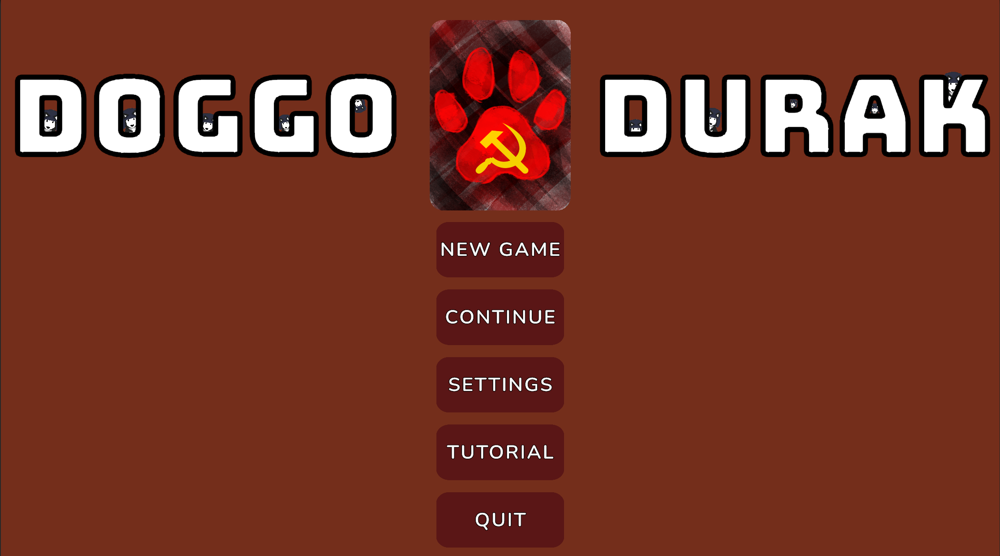

Everything here was built by one person in Unity, mostly as a learning project. It is
open source and free to read, fork and learn from.

## Status

The game is playable from start to finish. Runs, combat, items, the shop and the tutorial
all work.

It is not content complete. I did not have anyone to work with on graphics, so the art is
placeholder work and some of the planned content is missing or rough around the edges. I
am not going to finish it, so I am putting the code out here for anyone who wants to learn
from it or build on top of it.

If you want to try it, open the project in Unity and press play from the Main Menu scene.

## How to play

There are two types of turn. Watch the arrows on the cards, they point at the player who is
defending.

### Attacking turns

On an attacking turn you can attack with any card in your hand. The opponent has to defend
against it.

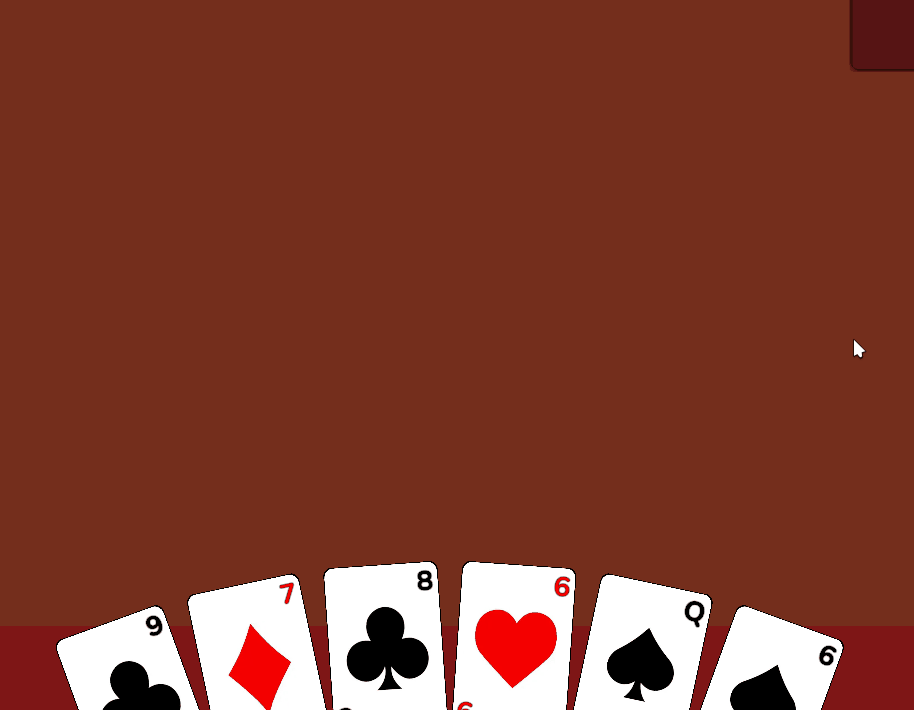

Any card that is not defended deals damage to the defending player.

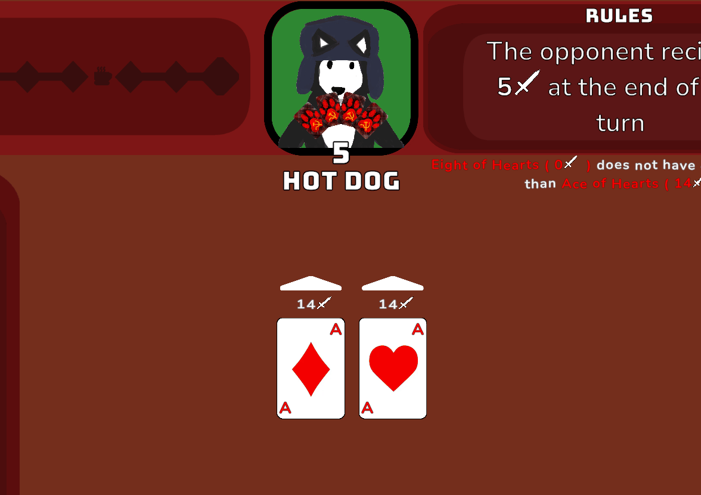

### Defending turns

On a defending turn you have to defend with a card that has a higher number of the same suit,
or with a card of the trump suit. The trump suit changes every encounter, so a card that was
useless last fight might be your best option now.

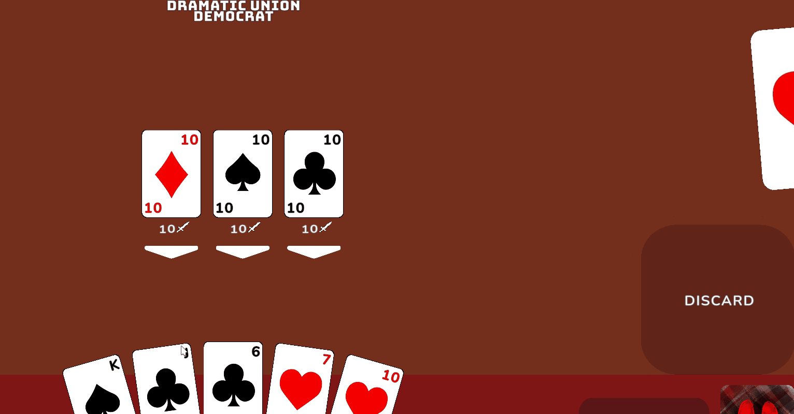

### Reversing

If you are the defending player and you have not defended any of the cards yet, you can play a
card with the same number as all the other cards on the table to reverse the turn order. That
swaps who is attacking and who is defending, which can turn a losing turn into a winning one.

### Passing the turn

Press SPACE to pass priority to the opponent. If the opponent has no response, press SPACE
again to finish the turn and attack with your cards. There is also a pass turn button if you
prefer clicking.

Read the tooltips, they explain every item and modifier in the game. Have fun.

## The game

### Picking a character

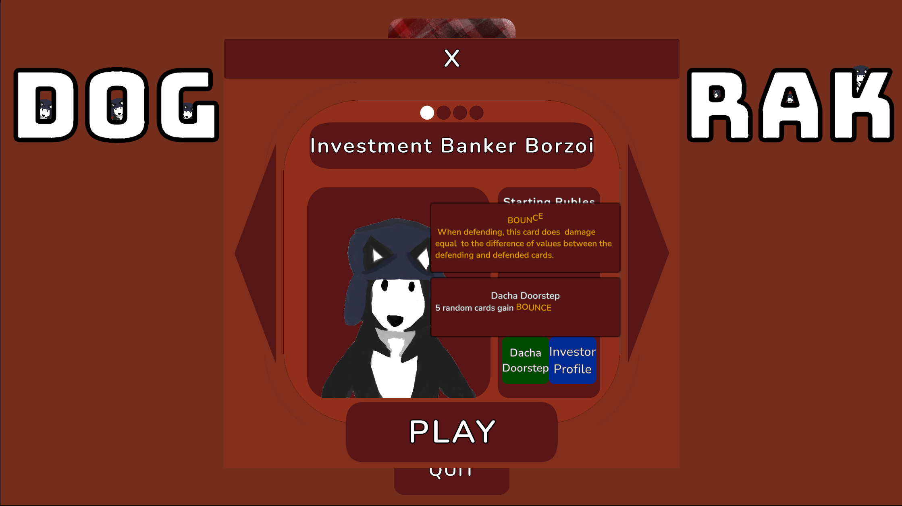

Four characters, each with their own starting deck/items, health and way of earning money. 

### The card table
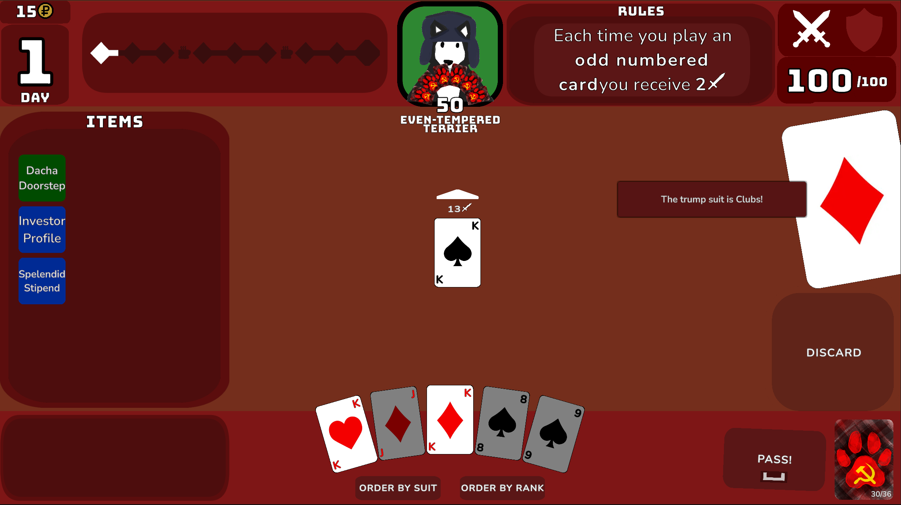
### Your deck
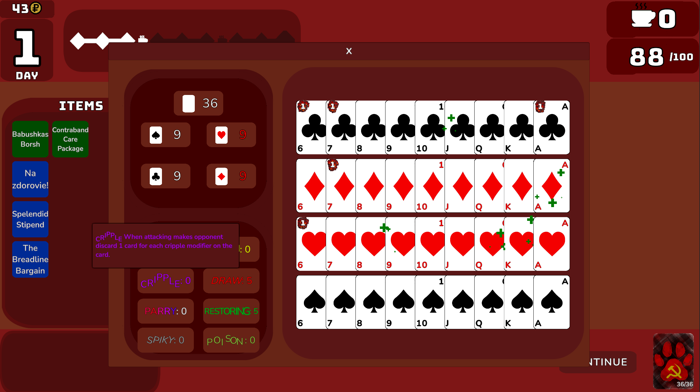

Because items and rewards push cards into your deck, a run can push far past the standard
36 cards.Card nunmbers can grow indefinitely. A big deck dilutes your draws but gives you more options, and that trade is the central tension of a run.

### Card modifiers

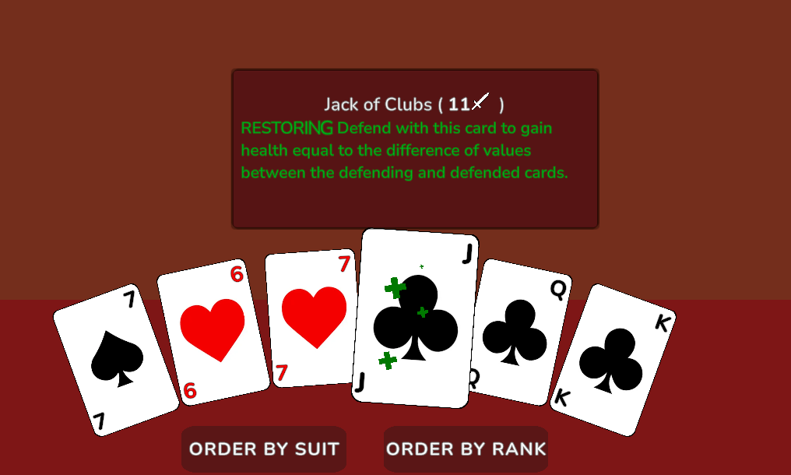

Modifiers are the main way the game bends a card away from its printed value. A card is just
a suit and a number until something attaches a modifier to it.

- Restoring: defend with this card to heal by the difference in value between it and the
  card it defends.
- Bounce: when defending, deal damage equal to that same difference.
- Burn: deal one damage for each burn modifier on the card.
- Parry: reverse with this card to deal its value as damage.
- Draw: draw one card for each draw modifier when the card is played.
- Cripple: make the opponent discard one card for each cripple modifier.
- Spiky: when this card is defended, deal one damage per spiky modifier to the defender.
- Poison: apply poison counters when this card deals damage. At the end of the turn the
  target takes damage equal to its poison counters, then one counter is removed.

Modifiers stack and they are capped per card, so the same card can end up a very different
card depending on what you have found.

### Boss encounters

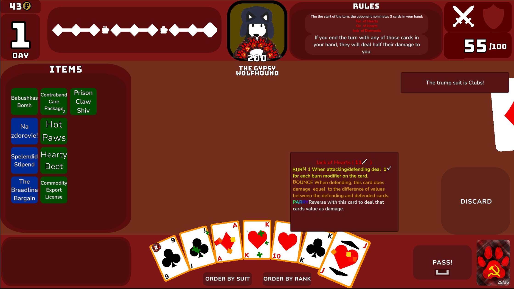

Every twelfth encounter is a boss. Bosses carry rules that change how the fight works, such as shifting probabilities turn by turn or forcing a
different turn order. 
Regular encounters do this too. With 35 encounters in the game, a lot of them bend the normal
flow of a turn in some way.

### Rewards

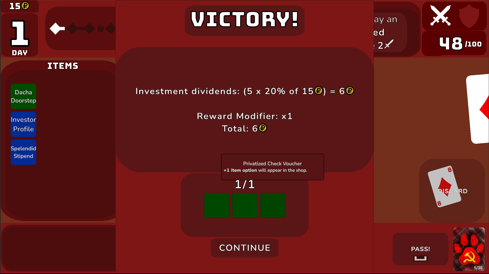

Winning a fight pays out in two currencies. Cards and items go into your deck and your
inventory. The rubles are the interesting part, because the payout is not a flat number.

You character starts with an item  that defines how you get money at the end of an encounter. More can be picked up as rewards or from shops. Lean into what makes your character rich and take over the game!

### The rest phase

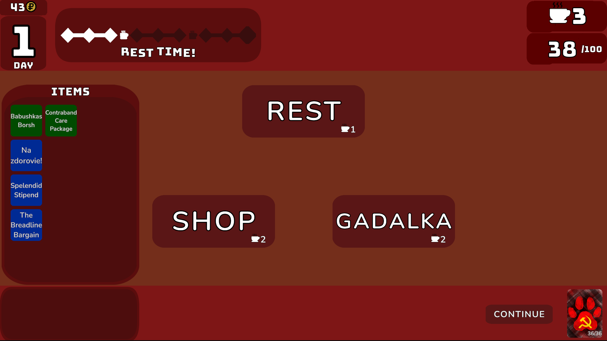

After every third fight you get a rest instead of another fight.This is where you spend your rest point to: heal, buy from the shop, or take a risk with the Gadalka(explained further)!

### The shop

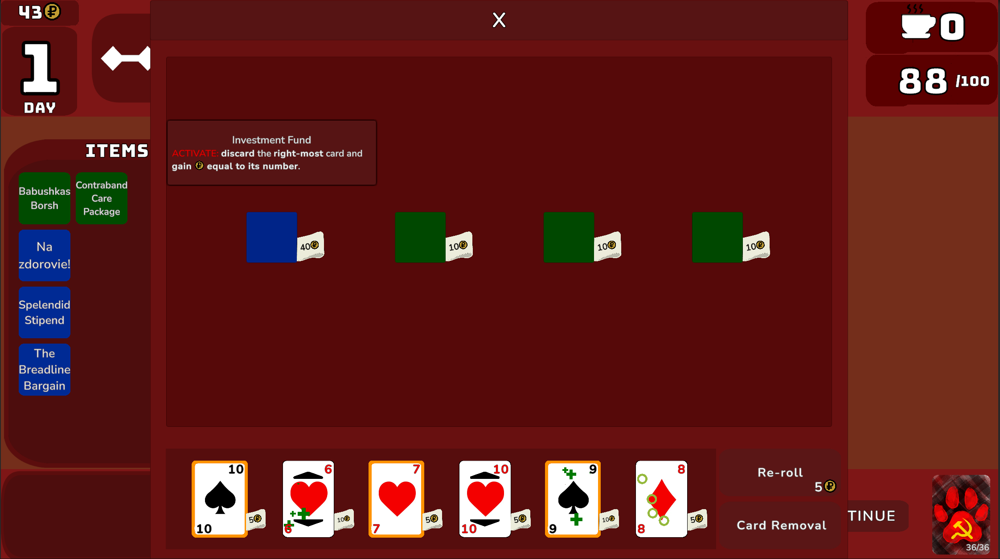

The shop sells cards and items, and it can be rerolled for a price. Rerolls go up in cost,
so repeatedly refreshing is an option early and a bad idea later. Some items make shopping
cheaper, which turns the reroll button from a luxury into a strategy.

### The Gadalka

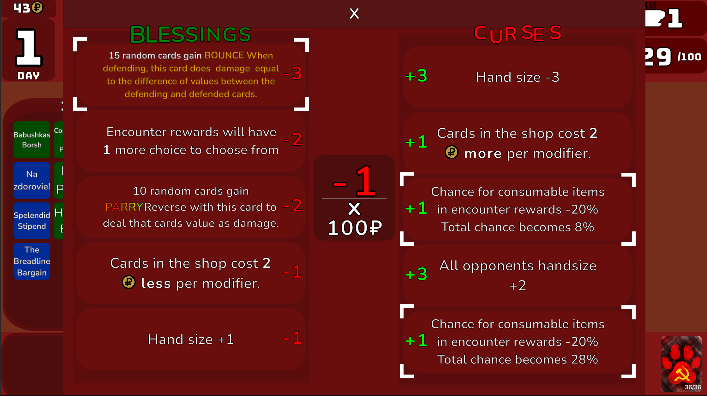

The Gadalka is a fortune teller who trades blessings and curses. She is useful and she is
never free, which is the whole point. A blessing might upgrade cards in your deck, change
drop rates or cut shop prices. A curse will do the opposite, or hand you something you did
not ask for.

## Tech stack

- Unity 6000.4.0f1
- Universal Render Pipeline, 2D
- C# with the new Input System
- TextMesh Pro and Febucci Text Animator for the text effects
- UniTask for async flows and animation sequencing
- ScriptableObject assets for all content: items, encounters, characters and Gadalka effects

## Project layout

```
Assets/
  Scripts/
    CardModifier/    card modifiers, the effects that change card behaviour
    Cards/           card logic, hand, deck, discard pile, play area
    Character/       playable characters
    Encounter/       encounters and the encounter manager
    GadalkaEffect/   blessings and curses
    GameHandlers/    GameHandler, TurnHandler and RuleHandler, the three main orchestrators
    GameState/       GameState, CardInfo and save handling
    Item/            item base class and every item implementation
    Opponent/        opponent AI and the opponent hand view
    Reward/          rewards, currency and shop inventory
    ToolTip/         tooltips
    UI/              screens and UI components
    Tutorial/        tutorial setup
  Plugins/Febucci/   vendored Text Animator
  Prefabs/
  Resources/         content assets, loaded at runtime
  Scenes/            MainMenu, CardTable, Rest and Tutorial
```

The three handlers in `GameHandlers` do most of the orchestration. `GameHandler` owns the run and
switches scenes, `TurnHandler` runs the turn phases, and `RuleHandler` deals with trump suits and
win and loss conditions. Content lives in `Resources` as ScriptableObjects, so adding a new item or
encounter does not require touching the core logic.

## License

GPL-3.0. See [LICENSE](LICENSE).

The vendored Febucci Text Animator plugin in `Assets/Plugins` is by Pierpaolo Bazzini and keeps its
own license.
